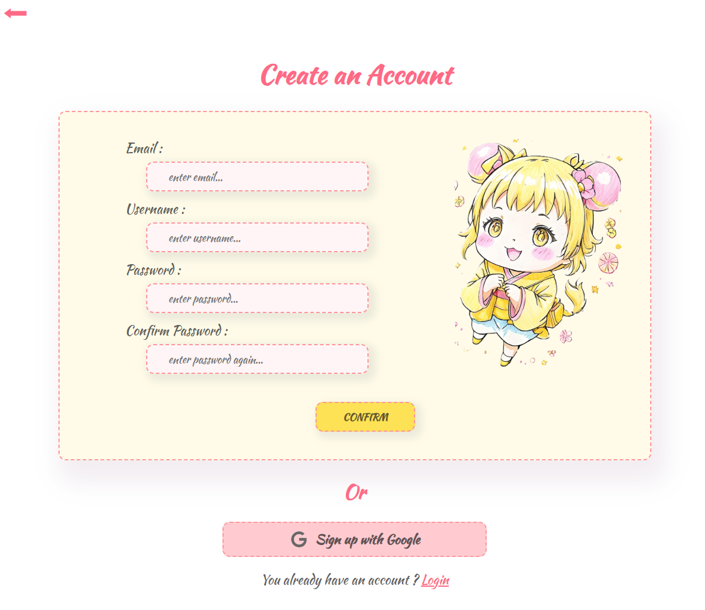
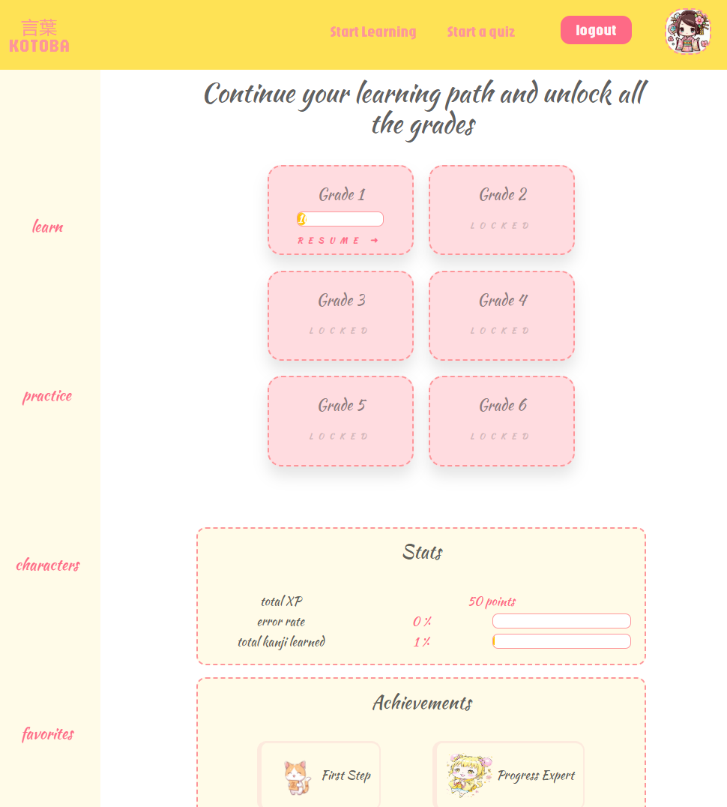
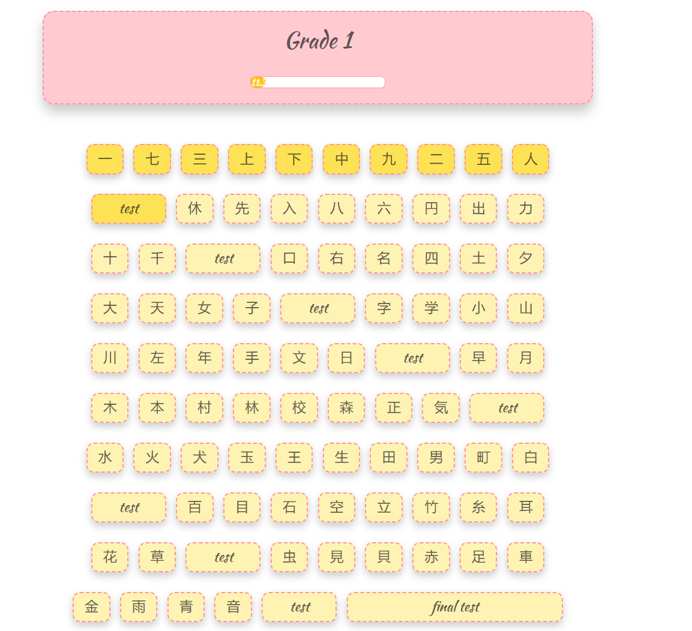
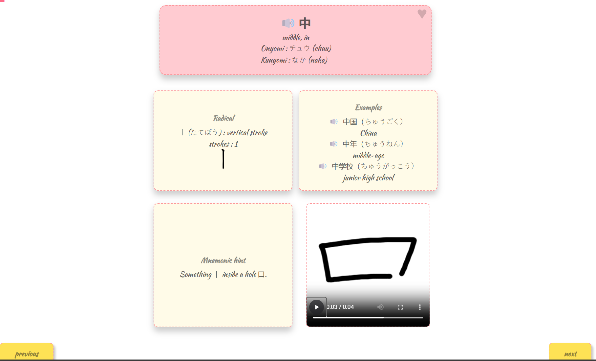
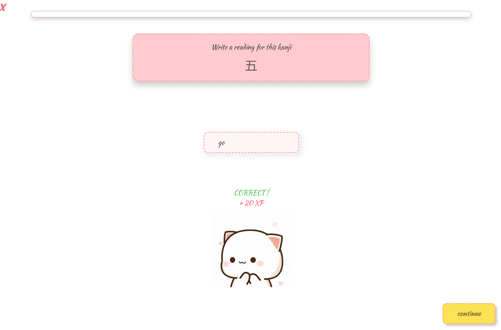
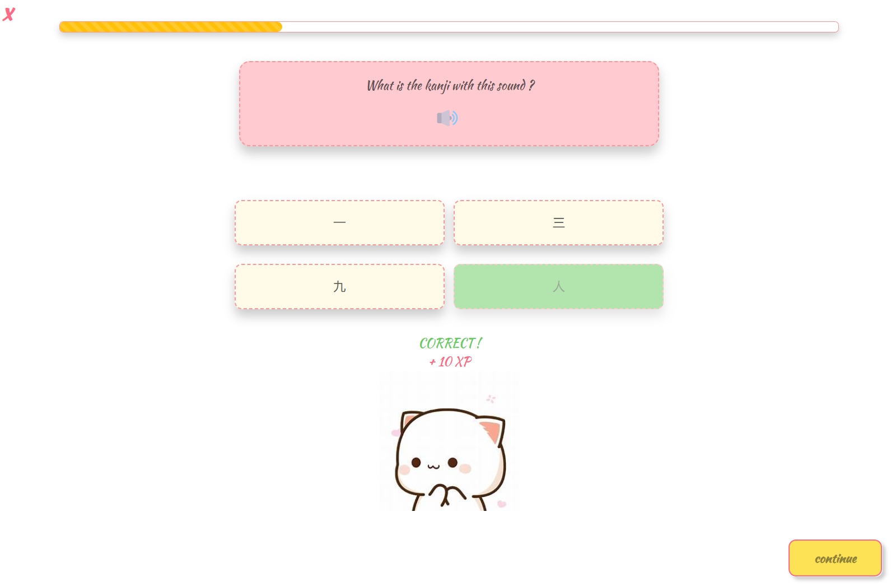
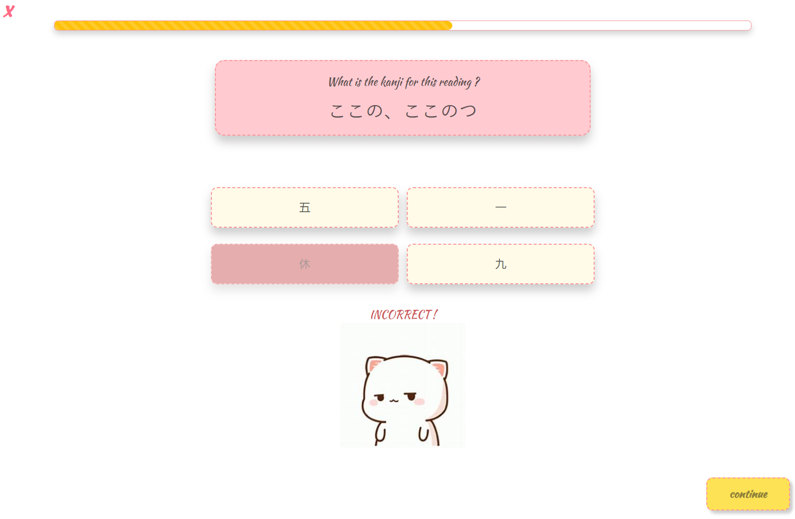
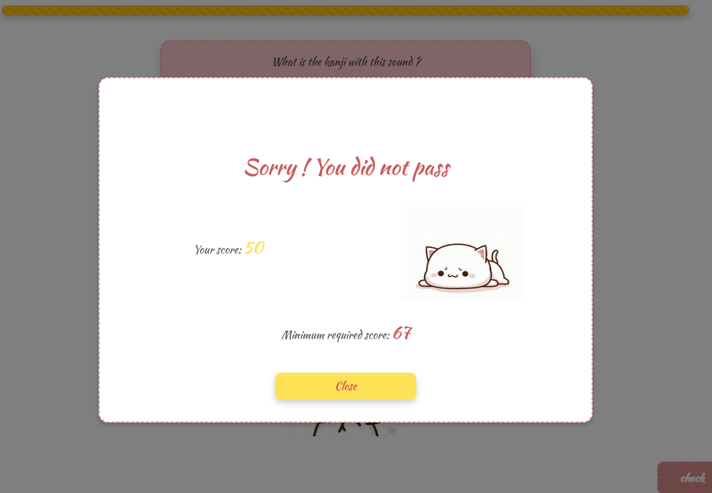

# KOTOBA a kanji Learning Platform

A Spring Boot-based web application designed to help users learn Kanji efficiently. The application allows users to explore Kanji characters, view their details, and track their learning progress.

## Features
- **Kanji Search**: Quickly search for Kanji using English keywords, making it easier to find the characters you need.
- **Grade-Based Kanji Display**: Explore and study Kanji categorized by grade level for structured learning.
- **Learning Progress**: Track progress, including XP, error rates, and achievements.
- **Custom Authentication**: Seamlessly log in using a standard account or Google OAuth2 for added convenience.
- **Personalized Tests**: Practice Kanji you've recently learned with targeted tests, and challenge yourself with a final comprehensive test for each grade.
- **Interactive Interface**: Clean and user-friendly interface for effective learning.

## Screenshots

- Signup Page



- Learning Page


  

- Grade Page


  

- Kanji Details Page


  

- Test Question Example 1


  

- Test Question Example 2


  

- Test Question Example 3


  

- Test Result


  


## Tech Stack
- **Backend**: Spring Boot
    - mySQL for data persistence
    - Spring Security for authentication and authorization
- **Frontend**: Thymeleaf templates with Bootstrap for styling
- **API Integration**: Uses Kanji Live API for fetching Kanji data
- **Authentication**: Google OAuth2 for user signup and login

## Installation

1. Clone the repository:
   ```bash
   git clone https://github.com/MAY55A/KOTOBA
   cd <repository-directory>
   ```
2. Build the project:

   ```bash
    mvn clean install
   ```
3. Run the application:

   ```bash
    mvn spring-boot:run
   ```
4. Access the application:
Open http://localhost:8080 in your browser.

## API Endpoints
- "/api/kanji?grade=" : Fetch kanji by grade
- "/api/kanji/search?query=" : Fetch kanji for given query
- "/api/kanji/random" : Fetch random japanese sentence
- "/api/kanji/{word}" : Fetch kanji details
- "/api/kanji/next?kanji=&grade=" : Fetch next kanji to the given kanji of given grade
- "/api/kanji/previous?kanji=&grade=" : Fetch previous kanji to the given kanji of given grade
- "/api/quizzes/final-test?grade=" : Fetch generated final test for given grade
- "/api/quizzes/unit-test?grade=&test=" : Fetch generated test for given grade (test param representing the test number)
- "/api/quizzes/skill-quiz?questions=" : Fetch generated skill quiz with given number of questions

## Consumed APIs
- "https://jlpt-vocab-api.vercel.app/api/words?offset=&limit" : Fetch japanese words for given offset and limit (nb words)
- "https://jlpt-vocab-api.vercel.app/api/words/random" : Fetch random japanese word
- "https://kanjialive-api.p.rapidapi.com/api/public/search/{query}" : Fetch kanji for query
- "https://kanjialive-api.p.rapidapi.com/api/public/kanji/{kanji}" : Fetch details for kanji
- "https://kanjiapi.dev/v1/kanji/grade-{grade}" : Fetch kanji of given grade
- "https://translate.google.com/translate_tts?ie=UTF-8&q={kanji}&tl=ja&client=tw-ob" : Fetch audio for given kanji

## Database
Update the application.properties file:
   ```properties
spring.datasource.url = jdbc:mysql://localhost:3306/kotoba?createDatabaseIfNotExist=true&useUnicode=true&useJDBCCompliantTimezoneShift=true&useLegacyDatetimeCode=false&serverTimezone=UTC
spring.datasource.username = root
spring.datasource.password =
   ```
## Authentication
The platform supports standard login and Google OAuth2.
A custom login page is provided for users.

## Future Enhancements
- Make the website more stable (fix bugs, add better security mechanism)
- Improve test generation by reducing generation time
- Implement the skill quizzes custom made API.
- Finish favorites management.
- Add profile management.
- Add a leaderboard to encourage competition among users.
- Implement more achievement milestones.
- Enhance the dynamic grid layout with animations and interactivity.

## License
This project is licensed under the MIT License.

## Contributors
Mayssa Ghanmi - MAY55A - mayssagnm@gmail.com
- Website - https://may55a.github.io/Social-links-profile/
- LinkedIn - [@Mayssa Ghanmi](https://www.linkedin.com/in/mayssa-ghanmi-a85369276)